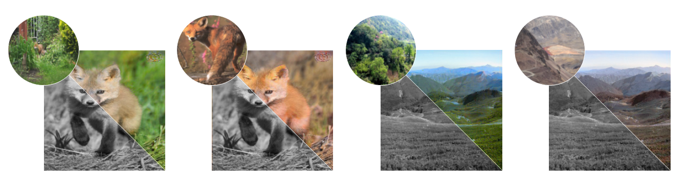

**XCNET**: Attention-based Stylisation for Exemplar Image Colourisation
========
PyTorch official implementation for **XCNET** (E**X**emplar **C**olourisation **NE**twork). We introduce a fast end-to-end 
architecture for exemplar-based image colourisation. The proposed network outperforms state-of-the-art methods in 
both visual quality and complexity, achieving runtimes of less than a second.



Most existing methods tackle the exemplar-based colourisation task as a style transfer problem, using a convolutional 
neural network (CNN) to obtain deep representations of the content of both target and reference inputs. Stylised outputs
are then obtained by computing similarities between both feature representations in order to transfer the style of the 
reference to the content of the target input. However, in order to gain robustness towards dissimilar references, 
the stylised outputs need to be refined with a second colourisation network, which significantly increases the overall 
system complexity. This work reformulates the existing methodology introducing a novel end-to-end colourisation network 
that unifies the feature matching with the colourisation process. The proposed architecture integrates attention modules 
at different resolutions that learn how to perform the style transfer task in an unsupervised way towards decoding 
realistic colour predictions. Moreover, axial attention is proposed to simplify the attention operations and to obtain 
a fast but robust cost-effective architecture. 

For more details have a look at our [paper](https://arxiv.org/abs/2105.01705) and [blog post](https://www.bbc.co.uk/rd/blog/2021-05-video-quality-artificial-intelligence-colourisation). 
Please cite with the following Bibtex code:
```
@article{blanch2021attention,
  title={Attention-based Stylisation for Exemplar Image Colourisation},
  author={Blanch, Marc Gorriz and Khalifeh, Issa and Smeaton, Alan and O'Connor, Noel and Mrak, Marta},
  journal={arXiv preprint arXiv:2105.01705},
  year={2021}
}
```

# Docker usage
All the packages and dependencies are encapsulated into a Docker container, making the code very simple and easy to use.
In order to run the code, install 
[NVIDIA Container Toolkit](https://docs.nvidia.com/datacenter/cloud-native/container-toolkit/install-guide.html) 
on Ubuntu > 16.04:
```bash
> curl https://get.docker.com | sh && sudo systemctl --now enable docker
> distribution=$(. /etc/os-release; echo $ID$VERSION_ID) \
   && curl -s -L https://nvidia.github.io/nvidia-docker/gpgkey | sudo apt-key add - \
   && curl -s -L https://nvidia.github.io/nvidia-docker/$distribution/nvidia-docker.list | \
   sudo tee /etc/apt/sources.list.d/nvidia-docker.list
> sudo apt-get update
> sudo apt-get install -y nvidia-docker2
> sudo systemctl restart docker
```
Finally, install ECNET by running:
```bash
> sudo sh install.sh
```

## Data preparation
Download [ImageNet ILSVRC 2012](http://www.image-net.org/challenges/LSVRC/2012/index) training dataset and save the 
compressed file (`ILSVRC2012_img_train.tar`) into ```path/to/dataset```. We expect the directory structure to be 
the following:
```
path/to/dataset
  LSVRC2012_img_train.tar  # 138GB. MD5: 1d675b47d978889d74fa0da5fadfb00e
```
Finally, in order to process the data and create a suitable dataset run:
```bash
> sudo sh run.sh -a data -d path/to/dataset
```

## Training
To train baseline ECNET on a single GPU, create a config file similar to ```src/config/baseline.py``` and run:
```bash
> sudo sh run.sh -a train -e experiment_name -c path/to/config -d path/to/dataset
```
Extra options are the following (for more information call ```sudo sh run.sh -h```):
```
-h              Show help.
-a <action>     Select action (data | train).
-d <path>       Path to dataset.
-e <name>       Experiment name -> output_path: experiments/[experiment_name].
-c <path>       Path to config file.
-g <number>     Cuda device number.
-m <number>     Memory shm-size (GB).
```
Tensorboard logs and model checkpoints will be stored at ```experiments/[experiment_name]```.

## Hands-on demo
You can load pre-trained XCNET models by opening a Python bash and running:
```bash
from src.models.xcnet import xcnet
model = xcnet(pretrained=True)
```
For more information check ou our [hands-on demo notebook](demo/test_xcnet.ipynb).

# Alternative usage
In case of not having root privileges, an alternative usage can be performed by installing by hand all the required
dependencies within a CUDA 10.2 and Ubuntu 18.2 environment (follow the commands in ```Dockerfile```). 

Data preparation can be done by running:
```bash
> python src/data/process_data.py -d path/to/dataset
> python src/data/create_database.py -d path/to/dataset -g cuda:[GPU number]
```

Then to train XCNET run the following:
```bash
> python src/data/process_data.py -d path/to/dataset
> mkdir -p experiments/[experiment_name]
> python src/train.py -d path/to/dataset -c path/to/config \
-o experiments/[experiment_name] -g cuda:[GPU_number]
```

# Acknowledgements
This work has been conducted within the project
JOLT. This project is funded by the European Union’s Horizon 2020 research
and innovation programme under the Marie Skłodowska Curie grant agreement No 765140.

|  |  |
|:-:|:-:|
| [JOLT Project](http://joltetn.eu/) | [European Comission](https://ec.europa.eu/programmes/horizon2020/en) |

# Contact

If you have any general doubt about our work or code which may be of interest for other researchers, 
please use the [public issues section](https://github.com/bbc/xcnet/issues) on this github repo. 
Alternatively, drop us an e-mail at <mailto:marc.gorrizblanch@bbc.co.uk>.
